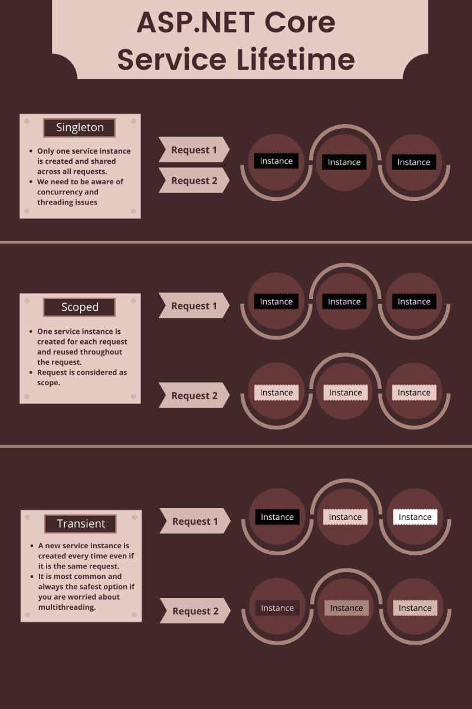

# Student

Easy Rest api with Ef core

## [Add Dependency Injection Methods](https://stackoverflow.com/questions/38138100/addtransient-addscoped-and-addsingleton-services-differences)



### AddScoped

```c#
builder.Services.AddScoped<IStudentService, StudentService>();
```

Scoped lifetime services are created once per request.

### AddTransient

```c#
builder.Services.AddTransient<IStudentService, StudentService>();
```

Transient lifetime services are created each time they are requested. This lifetime works best for lightweight, stateless services.

### AddSingelton

```c#
builder.Services.AddSingelton<IStudentService, StudentService>();
```

Singleton lifetime services are created the first time they are requested (or when ConfigureServices is run if you specify an instance there) and then every subsequent request will use the same instance.


## Entityframework Core

There are some possibilities to implement DbContext

- Add DbContext to Startup file

```c#
builder.Services.AddDbContext<Database>(opt => //onConfiguring inDbContext
{
    var config = new ConfigurationBuilder()
        .AddJsonFile(Path.Combine(Environment.CurrentDirectory, dbConnectionString))
        .Build();
    opt.UseSqlServer(config.GetConnectionString(defaultConnectionString));
});

// or

builder.Configuration.GetConnectionString("DefaultConnectionString");

builder.Services.AddDbContext<Database>(opt => //onConfiguring inDbContext
{
    opt.UseSqlServer(builder.Configuration.GetConnectionString("DefaultConnectionString"));
    // use oder DB use
    opt.UseNpgSqlServer('context');
    //....
});
```

Configuration builder grab db context from appsettings.json

- Add by overriding onConfiguring in DbContext class

```c#
 protected override void OnConfiguring(DbContextOptionsBuilder optionsBuilder)
    {
        var config = new ConfigurationBuilder()
            .AddJsonFile(Path.Combine(Environment.CurrentDirectory, _dbConnectionString))
            .Build();
        optionsBuilder.UseSqlServer(config.GetConnectionString(_defaultConnectionString));
        base.OnConfiguring(optionsBuilder);
    }
```

### Create and Migrate Database ef
```bash
$ dotnet tool install --global dotnet-ef
$ dotnet add package Microsoft.EntityFrameworkCore.Design
$ dotnet ef migrations add InitialCreate
$ dotnet ef database update
```